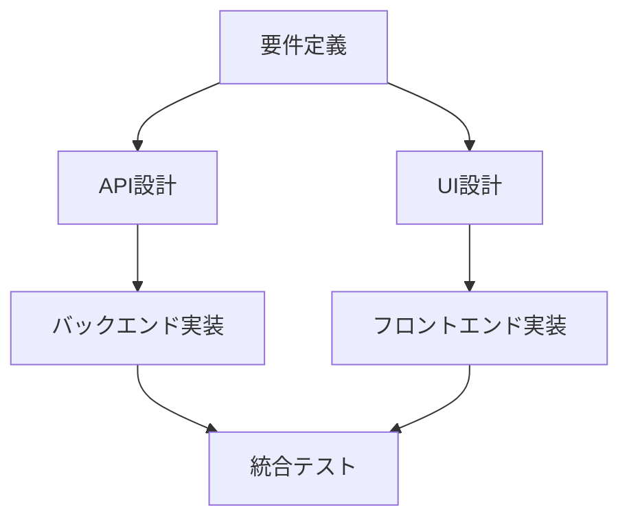

# 実装ガイド：数学的タスク管理フレームワークの導入手順

## 段階的導入アプローチ

実際のプロジェクトチームがこのフレームワークを導入する際の、現実的で段階的なアプローチを示します。

---

## Phase 1: 基本構造の導入（1-2週間）

### Step 1: 現在のタスクを数学的に表現

**既存のタスク管理ツールから情報を抽出**

```python
# 既存タスクの構造化
existing_tasks = [
    {
        "name": "API設計",
        "assignee": "田中",
        "dependencies": ["要件定義"],
        "estimated_hours": 16,
        "status": "未着手"
    },
    {
        "name": "フロントエンド実装", 
        "assignee": "佐藤",
        "dependencies": ["API設計", "UI設計"],
        "estimated_hours": 24,
        "status": "進行中"
    }
]

# 数学的表現への変換
def convert_to_mathematical_task(task_data):
    return Task(
        id=generate_id(task_data["name"]),
        input_type=infer_input_type(task_data["dependencies"]),
        output_type=infer_output_type(task_data["name"]),
        function=create_task_function(task_data),
        dor_conditions=extract_start_conditions(task_data),
        dod_conditions=extract_completion_conditions(task_data)
    )
```

### Step 2: 依存関係の可視化

**既存のプロジェクトで依存関係をDAGとして表現**



### Step 3: 基本的なDoR/DoD条件の設定

**まずは簡単な条件から開始**

```yaml
tasks:
  API設計:
    dor:
      - requirements_document_approved
      - technical_lead_available
    dod:
      - api_specification_complete
      - peer_review_passed
      
  フロントエンド実装:
    dor:
      - ui_mockups_finalized
      - api_endpoints_ready
    dod:
      - all_screens_implemented
      - unit_tests_passed
```

---

## Phase 2: 動的監視の導入（2-3週間）

### Step 4: 進捗監視システムの構築

**日次チェックの自動化**

```python
class ProgressMonitor:
    def __init__(self, task_network):
        self.network = task_network
        self.daily_snapshots = []
    
    def daily_check(self):
        """毎日の進捗確認"""
        snapshot = {
            'date': datetime.now(),
            'tasks': {},
            'issues': []
        }
        
        for task_id, task in self.network.tasks.items():
            # 期待値と実績の比較
            expected = self.get_expected_progress(task_id)
            actual = self.get_actual_progress(task_id)
            
            if abs(expected - actual) > 0.2:  # 20%以上の差異
                snapshot['issues'].append({
                    'task': task_id,
                    'expected': expected,
                    'actual': actual,
                    'deviation': actual - expected
                })
        
        self.daily_snapshots.append(snapshot)
        return snapshot
    
    def get_expected_progress(self, task_id):
        """予定進捗率を計算"""
        task = self.network.tasks[task_id]
        days_since_start = (datetime.now() - task.start_date).days
        return min(days_since_start / task.estimated_days, 1.0)
    
    def get_actual_progress(self, task_id):
        """実際の進捗率を取得"""
        # GitHub Issues, Jira, Asana等から進捗を取得
        return self.network.tasks[task_id].completion_ratio
```

### Step 5: 問題検出アルゴリズムの実装

```python
def detect_issues(progress_snapshot):
    """問題を自動検出"""
    issues = []
    
    for issue in progress_snapshot['issues']:
        if issue['deviation'] < -0.3:  # 30%以上の遅延
            issues.append({
                'type': 'schedule_delay',
                'severity': 'high',
                'task': issue['task'],
                'impact': calculate_downstream_impact(issue['task'])
            })
        elif issue['deviation'] > 0.2:  # 20%以上の前倒し
            issues.append({
                'type': 'resource_available',
                'severity': 'low', 
                'task': issue['task'],
                'opportunity': identify_acceleration_opportunity(issue['task'])
            })
    
    return issues
```

---

## Phase 3: 自動再構成の導入（3-4週間）

### Step 6: 基本的な再構成パターンの実装

**よくある問題への対応パターンを事前定義**

```python
class ReconfigurationEngine:
    def __init__(self):
        self.patterns = {
            'member_unavailable': self.handle_member_unavailable,
            'task_complexity_increase': self.handle_complexity_increase,
            'dependency_delay': self.handle_dependency_delay,
            'quality_issue': self.handle_quality_issue
        }
    
    def handle_member_unavailable(self, issue_context):
        """メンバー不在時の対応"""
        unavailable_member = issue_context['member']
        affected_tasks = issue_context['tasks']
        
        solutions = []
        
        for task in affected_tasks:
            # 代替担当者を探す
            alternatives = self.find_alternative_assignees(task)
            if alternatives:
                solutions.append({
                    'type': 'reassign',
                    'task': task.id,
                    'from': unavailable_member,
                    'to': alternatives[0],
                    'estimated_impact': self.calculate_reassignment_cost(task, alternatives[0])
                })
            else:
                # タスク分割を検討
                if self.can_split_task(task):
                    solutions.append({
                        'type': 'split',
                        'task': task.id,
                        'subtasks': self.propose_task_split(task),
                        'estimated_impact': self.calculate_split_cost(task)
                    })
        
        return solutions
    
    def handle_complexity_increase(self, issue_context):
        """複雑さ増加時の対応"""
        complex_task = issue_context['task']
        
        # 追加リソースの投入を検討
        if self.has_available_resources():
            return [{
                'type': 'add_resource',
                'task': complex_task.id,
                'additional_members': self.suggest_additional_members(complex_task),
                'estimated_impact': -0.3  # 30%の時間短縮見込み
            }]
        
        # タスクの分割を検討
        return [{
            'type': 'split_and_parallelize',
            'task': complex_task.id,
            'parallel_subtasks': self.design_parallel_subtasks(complex_task),
            'estimated_impact': -0.4  # 40%の時間短縮見込み
        }]
```

### Step 7: 意思決定支援システム

```python
class DecisionSupport:
    def __init__(self, reconfiguration_engine):
        self.engine = reconfiguration_engine
        self.cost_calculator = CostCalculator()
    
    def recommend_action(self, detected_issues):
        """最適なアクションを推奨"""
        all_solutions = []
        
        for issue in detected_issues:
            solutions = self.engine.patterns[issue['type']](issue)
            all_solutions.extend(solutions)
        
        # コスト・効果分析
        ranked_solutions = []
        for solution in all_solutions:
            cost = self.cost_calculator.calculate_cost(solution)
            benefit = self.cost_calculator.calculate_benefit(solution)
            roi = benefit / cost if cost > 0 else float('inf')
            
            ranked_solutions.append({
                'solution': solution,
                'cost': cost,
                'benefit': benefit,
                'roi': roi,
                'recommendation_level': self.classify_recommendation(roi)
            })
        
        # ROIでソート
        ranked_solutions.sort(key=lambda x: x['roi'], reverse=True)
        return ranked_solutions
    
    def classify_recommendation(self, roi):
        """推奨レベルの分類"""
        if roi > 3.0:
            return "strongly_recommended"
        elif roi > 1.5:
            return "recommended" 
        elif roi > 1.0:
            return "consider"
        else:
            return "not_recommended"
```

---

## Phase 4: チーム統合とカスタマイズ（継続的）

### Step 8: チーム固有のパラメータ調整

**チームの特性に応じたパラメータの最適化**

```python
class TeamProfiler:
    def __init__(self):
        self.team_characteristics = {}
    
    def analyze_team_velocity(self, historical_data):
        """チームベロシティの分析"""
        velocities = []
        for sprint in historical_data:
            planned = sum(task.estimated_hours for task in sprint.tasks)
            actual = sum(task.actual_hours for task in sprint.tasks)
            velocities.append(actual / planned)
        
        return {
            'average_velocity': np.mean(velocities),
            'velocity_variance': np.var(velocities),
            'predictability': 1 / (1 + np.var(velocities))  # 予測可能性指標
        }
    
    def calibrate_parameters(self, team_profile):
        """チームプロファイルに基づくパラメータ調整"""
        base_params = {
            'stability_weight': 0.5,        # λ parameter
            'quality_strictness': 0.7,      # μ parameter  
            'change_cost_alpha': 10,        # node change cost
            'change_cost_beta': 5,          # edge change cost
        }
        
        # 予測可能性の低いチームは安定性を重視
        if team_profile['predictability'] < 0.6:
            base_params['stability_weight'] = 0.7
        
        # 高い品質要求のあるプロジェクトは品質を厳格に
        if team_profile.get('quality_requirements') == 'high':
            base_params['quality_strictness'] = 0.9
        
        return base_params
```

### Step 9: 継続的学習システム

```python
class LearningSystem:
    def __init__(self):
        self.historical_decisions = []
        self.outcome_feedback = []
    
    def record_decision(self, context, recommended_action, chosen_action, outcome):
        """意思決定の記録"""
        self.historical_decisions.append({
            'timestamp': datetime.now(),
            'context': context,
            'recommended': recommended_action,
            'chosen': chosen_action,
            'outcome': outcome
        })
    
    def learn_from_outcomes(self):
        """結果からの学習"""
        # 推奨が採用されなかった場合の分析
        rejected_recommendations = [
            d for d in self.historical_decisions 
            if d['recommended'] != d['chosen']
        ]
        
        # 成功パターンの抽出
        successful_interventions = [
            d for d in self.historical_decisions
            if d['outcome']['success_score'] > 0.8
        ]
        
        return {
            'rejection_patterns': self.analyze_rejection_patterns(rejected_recommendations),
            'success_patterns': self.analyze_success_patterns(successful_interventions),
            'parameter_adjustments': self.suggest_parameter_adjustments()
        }
```

---

## 導入のためのチェックリスト

### 技術要件

- [ ] **データ収集基盤**: 既存プロジェクト管理ツールとの連携
- [ ] **計算環境**: Python 3.8+, NumPy, NetworkX
- [ ] **可視化ツール**: Matplotlib, Graphviz, または専用ダッシュボード
- [ ] **通知システム**: Slack, Teams, Emailとの統合

### 組織要件

- [ ] **チームトレーニング**: フレームワークの概念理解（2-4時間）
- [ ] **プロセス統合**: 既存の開発プロセスとの整合
- [ ] **権限設定**: 自動再構成の承認プロセス
- [ ] **継続的改善**: 定期的な振り返りとパラメータ調整

### 成功指標

- [ ] **効率向上**: プロジェクト完了時間の短縮 (目標: 10-20%)
- [ ] **品質向上**: 品質関連の問題発生率減少 (目標: 30%減)
- [ ] **予測精度**: スケジュール予測の精度向上 (目標: ±15%以内)
- [ ] **チーム満足度**: ストレス軽減とプロセス透明性の向上

---

## 段階的導入スケジュール例

| 週 | フェーズ | 主な活動 | 期待される効果 |
|----|----------|----------|---------------|
| 1-2 | Phase 1 | 基本構造導入、現状分析 | タスク関係の可視化 |
| 3-4 | Phase 2 | 監視システム構築 | 問題の早期発見 |
| 5-6 | Phase 3 | 自動再構成導入 | 迅速な問題対応 |
| 7-8 | Phase 4 | カスタマイズと最適化 | チーム特化の効率化 |
| 9+ | 継続運用 | 学習システムと改善 | 持続的な価値向上 |

このような段階的なアプローチにより、理論的なフレームワークを実際の開発現場で無理なく導入し、継続的に価値を生み出すことができます。
