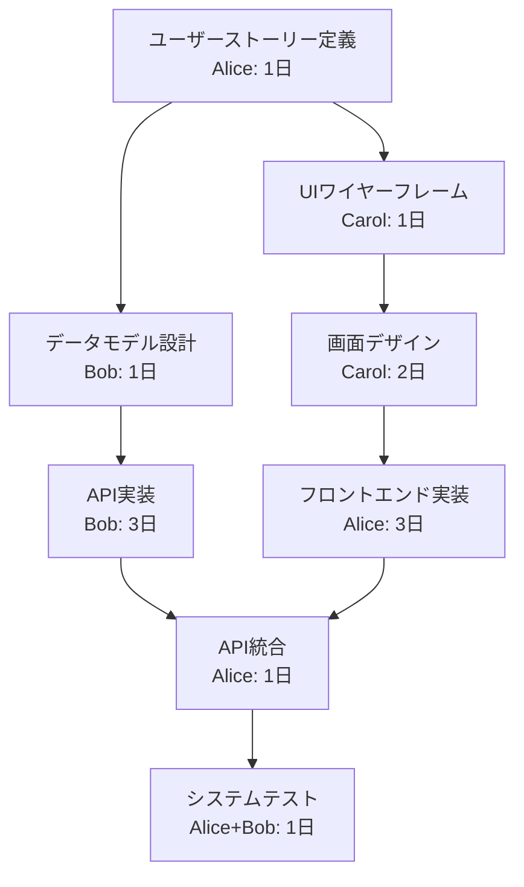
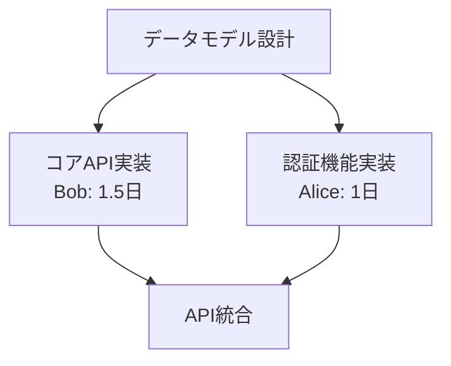
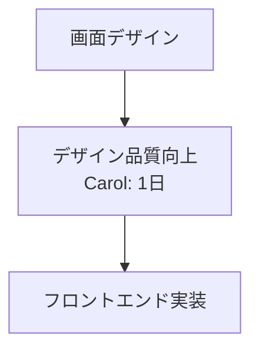

# 実践例：小規模チーム開発での動的タスク管理

## シナリオ：モバイルアプリ開発（3人チーム、2週間スプリント）

この例では、より身近な小規模開発チームでの日常的なタスク管理に数学的フレームワークを適用します。

---

## 1. チーム構成とスキル

**チームメンバー**：

- **Alice** (フルスタック): フロントエンド・バックエンド両方可能
- **Bob** (バックエンド特化): API開発・データベース設計が得意
- **Carol** (UI/UX): デザイン・フロントエンド実装が得意

**スキルマトリックス** (1-5段階):

| メンバー | フロントエンド | バックエンド | UI/UX | テスト |
|---------|--------------|------------|-------|--------|
| Alice   | 4            | 4          | 2     | 3      |
| Bob     | 2            | 5          | 1     | 4      |
| Carol   | 4            | 1          | 5     | 2      |

---

## 2. 初期スプリント計画

### 目標：タスク管理アプリのMVP（最小実行可能製品）

**初期タスクネットワーク** $\mathcal{T}_0$：



### 各タスクの詳細定義

**$v_1$: ユーザーストーリー定義**

- **入力** $I_{v1}$: プロダクト要求、競合調査
- **出力** $O_{v1}$: ユーザーストーリー一覧、受け入れ基準
- **DoR**: `product_requirements_available == True`
- **DoD**: `user_stories_prioritized == True AND acceptance_criteria_defined == True`
- **担当**: Alice
- **予定工数**: 1日

**$v_3$: データモデル設計**

- **入力** $I_{v3}$: ユーザーストーリー一覧
- **出力** $O_{v3}$: ERダイアグラム、API仕様書
- **DoR**: `user_stories_finalized == True`
- **DoD**: `data_model_reviewed == True AND api_spec_complete == True`
- **担当**: Bob
- **予定工数**: 1日

**射影写像の例**：

```python
def π_v1_to_v3(user_stories_output):
    """ユーザーストーリーからデータ要件を抽出"""
    user_stories, acceptance_criteria = user_stories_output
    data_requirements = extract_data_entities(user_stories)
    return data_requirements
```

---

## 3. Day 3: 最初の問題発生

### 問題：Carolの体調不良

**観測値** $\Omega_3$：

- Carol が体調不良で2日間離脱
- $v_2$ (UIワイヤーフレーム) が未完了
- $v_4$ (画面デザイン) が実行不可能

**差分** $\Delta_3$：

```json
{
  "v2": {
    "status": "blocked",
    "assignee": "Carol → UNAVAILABLE",
    "estimated_delay": 2
  },
  "v4": {
    "status": "cannot_start",
    "dependency_issue": "v2_incomplete"
  }
}
```

### 再構成の適用

**関係タイプ判定**: $\rho(\Delta_3) = \text{substitute}(v_2 \Rightarrow v_2')$

AliceがCarolのタスクを代替実行する再構成を行います。

**操作列**：

1. `substitute(v2 ⇒ v2')` where `assignee(v2') = Alice`
2. `update_f(v2', simplified_wireframe_function)`
3. `update_π(v2' → v4, reduced_design_complexity)`

**新しいタスク定義**：

- **$v_2'$**: 簡易UIワイヤーフレーム (Alice担当、0.5日)
- 出力を簡略化し、Carolの復帰後に詳細デザインを追加

---

## 4. Day 5: Bobの過負荷問題

### 問題：API実装の遅延

**観測値** $\Omega_5$：

- Bob の API実装 ($v_5$) が予定より1日遅延
- 技術的複雑さが想定を上回る
- Alice の待機時間が発生

**差分** $\Delta_5$：

```json
{
  "v5": {
    "progress": 0.6,
    "estimated_remaining": 2,
    "complexity": "higher_than_expected"
  },
  "resource_utilization": {
    "Alice": "underutilized",
    "Bob": "overloaded"
  }
}
```

### 再構成：タスク分割と負荷分散

**関係タイプ**: $\rho(\Delta_5) = \text{split}(v_5 \Rightarrow v_{5a} \parallel v_{5b})$

API実装を2つの並列タスクに分割：

- **$v_{5a}$**: コアAPI実装 (Bob, 1.5日)
- **$v_{5b}$**: 認証・バリデーション機能 (Alice, 1日)

**更新された依存関係**：



**射影写像の更新**：

```python
def π_v3_to_v5a(data_model_output):
    """コアAPI用のスキーマ抽出"""
    er_diagram, api_spec = data_model_output
    core_entities = extract_core_entities(er_diagram)
    return core_entities

def π_v3_to_v5b(data_model_output):
    """認証用のユーザー情報抽出"""
    er_diagram, api_spec = data_model_output
    auth_schema = extract_auth_requirements(api_spec)
    return auth_schema
```

---

## 5. Day 7: Carolの復帰と品質向上

### Carol復帰後の再最適化

**観測値** $\Omega_7$：

- Carol が復帰、フル稼働可能
- 現在の簡易デザインでは品質が不十分
- ユーザビリティ向上の余地あり

**関係タイプ**: $\rho(\Delta_7) = \text{downstream}(\tau_{design\_enhancement}; \{v_4\})$

Carol復帰を活かして品質向上タスクを追加：

**新タスク** $\tau_{design\_enhancement}$: デザイン品質向上

- **入力**: 現在の画面デザイン、ユーザーフィードバック
- **出力**: 改善されたUI/UXデザイン
- **担当**: Carol
- **工数**: 1日

**更新されたネットワーク**：



---

## 6. 最終結果とメトリクス

### 完了したプロジェクト構造

**最終タスクネットワーク** $\mathcal{T}_{final}$：

| タスク | 担当者 | 予定工数 | 実績工数 | 品質スコア |
|--------|--------|----------|----------|------------|
| ユーザーストーリー定義 | Alice | 1日 | 1日 | 95% |
| 簡易ワイヤーフレーム | Alice | 0.5日 | 0.5日 | 85% |
| データモデル設計 | Bob | 1日 | 1日 | 90% |
| 初期画面デザイン | Alice | 1.5日 | 1.5日 | 80% |
| デザイン品質向上 | Carol | 1日 | 1日 | 95% |
| コアAPI実装 | Bob | 1.5日 | 1.5日 | 90% |
| 認証機能実装 | Alice | 1日 | 1日 | 85% |
| フロントエンド実装 | Alice | 3日 | 2.5日 | 90% |
| API統合 | Alice | 1日 | 1日 | 90% |
| システムテスト | Alice+Bob | 1日 | 1日 | 95% |

### 変更コスト分析

**適用された再構成操作**：

1. **Day 3**: `substitute(v2 ⇒ v2')` - コスト: 15ポイント
2. **Day 5**: `split(v5 ⇒ v5a ∥ v5b)` - コスト: 25ポイント  
3. **Day 7**: `add_downstream(τ_design_enhancement)` - コスト: 10ポイント

**総変更コスト**: 50ポイント

**回避された損失**：

- スケジュール遅延防止: 80ポイント
- 品質低下防止: 40ポイント
- チーム士気維持: 30ポイント

**純利益**: 150 - 50 = 100ポイント

---

## 7. 学習と改善

### フレームワークから得られた洞察

**1. 柔軟な役割分担**

- 数学的な依存関係管理により、担当者変更時の影響を最小化
- スキルマトリックスとタスク特性のマッチング最適化

**2. プロアクティブな負荷分散**

- 過負荷検出時の自動的なタスク分割提案
- 並列化可能性の数学的判定

**3. 品質と効率のバランス**

- 制約条件下での最適解探索
- DoR/DoD条件による品質保証

### 次スプリントへの改善点

**パラメータ調整**：

- $\lambda = 0.4$ → 0.5 (安定性をやや重視)
- スキル不足タスクの重み係数を増加
- 品質向上タスクの優先度調整

**プロセス改善**：

- 日次の進捗監視頻度を向上
- チームメンバーの可用性をリアルタイム追跡
- 技術的リスクの早期検出機能を強化

---

## 8. 実装のためのツール設計

### 簡易実装例 (Python)

```python
from dataclasses import dataclass
from typing import Dict, List, Optional
from enum import Enum

class TaskStatus(Enum):
    NOT_STARTED = "not_started"
    IN_PROGRESS = "in_progress" 
    COMPLETED = "completed"
    BLOCKED = "blocked"

@dataclass
class Task:
    id: str
    name: str
    assignee: str
    estimated_hours: float
    dependencies: List[str]
    dor_conditions: Dict[str, bool]
    dod_conditions: Dict[str, bool]
    status: TaskStatus = TaskStatus.NOT_STARTED

@dataclass
class TeamMember:
    name: str
    skills: Dict[str, int]  # skill_name -> proficiency (1-5)
    availability: float     # 0.0-1.0
    current_load: float     # hours

class TaskNetwork:
    def __init__(self):
        self.tasks: Dict[str, Task] = {}
        self.team: Dict[str, TeamMember] = {}
    
    def add_task(self, task: Task):
        """新しいタスクを追加"""
        self.tasks[task.id] = task
        
    def check_dor(self, task_id: str) -> bool:
        """着手条件をチェック"""
        task = self.tasks[task_id]
        return all(task.dor_conditions.values())
    
    def check_dod(self, task_id: str) -> bool:
        """完了条件をチェック"""
        task = self.tasks[task_id]
        return all(task.dod_conditions.values())
    
    def detect_bottlenecks(self) -> List[str]:
        """ボトルネックを検出"""
        bottlenecks = []
        for member_name, member in self.team.items():
            if member.current_load > 0.8 * member.availability:
                bottlenecks.append(member_name)
        return bottlenecks
    
    def suggest_rebalancing(self, overloaded_member: str) -> List[str]:
        """負荷分散の提案"""
        suggestions = []
        # 過負荷メンバーのタスクで分割可能なものを探索
        for task_id, task in self.tasks.items():
            if (task.assignee == overloaded_member and 
                task.status == TaskStatus.IN_PROGRESS and
                task.estimated_hours > 4):
                suggestions.append(f"Split task {task_id}")
        return suggestions

# 使用例
network = TaskNetwork()

# チーム設定
network.team["Alice"] = TeamMember("Alice", {"frontend": 4, "backend": 4}, 1.0, 0.0)
network.team["Bob"] = TeamMember("Bob", {"backend": 5, "testing": 4}, 1.0, 0.0)
network.team["Carol"] = TeamMember("Carol", {"frontend": 4, "design": 5}, 0.0, 0.0)  # 体調不良

# タスク追加
network.add_task(Task(
    id="v1",
    name="ユーザーストーリー定義",
    assignee="Alice",
    estimated_hours=8,
    dependencies=[],
    dor_conditions={"requirements_available": True},
    dod_conditions={"stories_prioritized": False}
))

# ボトルネック検出
bottlenecks = network.detect_bottlenecks()
print(f"Bottlenecks: {bottlenecks}")
```

---

## 9. まとめ

この小規模チーム開発例では、数学的タスク管理フレームワークが以下を実現しました：

### 実用的な効果

1. **迅速な問題対応**: 体調不良による担当者変更を24時間以内に再構成
2. **効率的な負荷分散**: 技術的複雑さによる遅延を並列化で解決
3. **品質向上の機会活用**: メンバー復帰時の余力を品質向上に活用
4. **最小限の混乱**: 計画変更による影響を数学的に最小化

### フレームワークの実用性

- **小規模チームでも有効**: 3人程度の小さなチームでも明確な効果
- **日常的な問題に対応**: 体調不良、技術的困難などの現実的な問題
- **学習・改善の促進**: 定量的な分析による継続的改善

このように、理論的なフレームワークが実際の開発現場で具体的な価値を提供できることが示されました。
