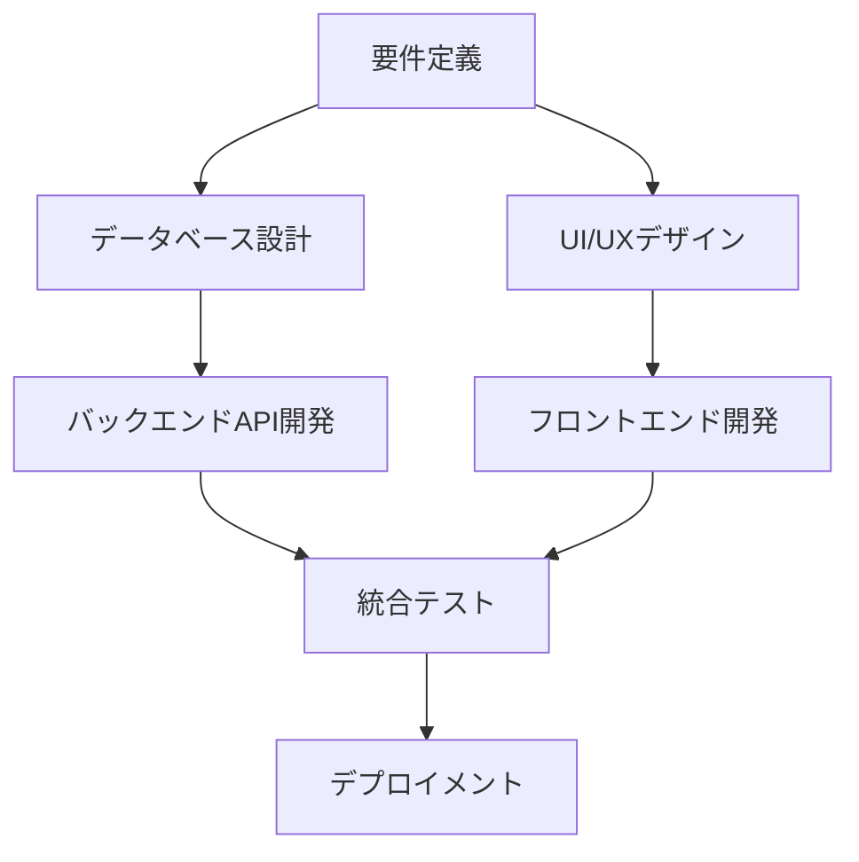

# タスク管理フレームワーク実例：ウェブアプリケーション開発プロジェクト

## プロジェクト概要

オンライン書店のウェブアプリケーションを開発するプロジェクトを例として、数学的タスク管理フレームワークの実際の適用例を示します。

---

## 1. 初期タスクネットワークの設計

### ステップ0：初期設定 $\mathcal{T}_0 = (V_0, E_0, F_0, \Pi_0)$

**ノード集合** $V_0$：

- $v_1$: 要件定義（Requirements Analysis）
- $v_2$: UI/UXデザイン（UI/UX Design）
- $v_3$: データベース設計（Database Design）
- $v_4$: バックエンドAPI開発（Backend API Development）
- $v_5$: フロントエンド開発（Frontend Development）
- $v_6$: 統合テスト（Integration Testing）
- $v_7$: デプロイメント（Deployment）

**依存関係** $E_0$：



**タスク関数** $F_0$：

**$f_{v1}$: 要件定義**

- 入力 $I_{v1}$: クライアント要求書、市場調査データ
- 出力 $O_{v1}$: 機能要件仕様書、非機能要件仕様書
- 関数定義: `requirements_analysis(client_request, market_data) → (functional_spec, non_functional_spec)`

**$f_{v2}$: UI/UXデザイン**

- 入力 $I_{v2}$: 機能要件仕様書
- 出力 $O_{v2}$: ワイヤーフレーム、UIモックアップ、デザインガイド
- 関数定義: `ui_design(functional_spec) → (wireframes, mockups, design_guide)`

**$f_{v3}$: データベース設計**

- 入力 $I_{v3}$: 機能要件仕様書、非機能要件仕様書
- 出力 $O_{v3}$: ERダイアグラム、テーブル定義、インデックス設計
- 関数定義: `db_design(functional_spec, non_functional_spec) → (er_diagram, table_definitions, index_design)`

**射影写像** $\Pi_0$：

**$\pi_{v1 \to v2}$**: $O_{v1} \to I_{v2}^{(v1)}$

```python
def projection_v1_to_v2(requirements_output):
    functional_spec, non_functional_spec = requirements_output
    return functional_spec  # UI設計には機能要件のみを使用
```

**$\pi_{v1 \to v3}$**: $O_{v1} \to I_{v3}^{(v1)}$

```python
def projection_v1_to_v3(requirements_output):
    functional_spec, non_functional_spec = requirements_output
    return (functional_spec, non_functional_spec)  # DB設計には両方を使用
```

### 品質管理条件

**$v_1$ (要件定義) の品質条件**：

- **DoR**: `stakeholder_approval == True and client_interview_completed == True`
- **DoD**: `requirements_reviewed == True and acceptance_criteria_defined == True`

**$v_4$ (バックエンドAPI開発) の品質条件**：

- **DoR**: `database_schema_approved == True and api_specification_complete == True`
- **DoD**: `unit_tests_passed == True and api_documentation_complete == True`

---

## 2. 実行フェーズと問題発生

### ステップ1：順調な実行

**実行順序**（線形拡張）: $v_1 \to \{v_2, v_3\} \to \{v_4, v_5\} \to v_6 \to v_7$

**ステップ1の観測** $\Omega_1$：

- $v_1$: 完了、DoD満足 ✓
- $v_2$: 完了、DoD満足 ✓  
- $v_3$: 完了、DoD満足 ✓

### ステップ2：問題の発生

**期待値** $\Theta_2(v_4)$：

- バックエンドAPI開発が順調に完了
- 予定工数: 5日
- 品質: 全機能実装完了

**観測値** $\Omega_2(v_4)$：

- セキュリティ要件の見落としが判明
- 追加工数が必要
- DoD条件不満足: `security_audit_passed == False`

**差分** $\Delta_2$：

```
Δ₂(v₄) = {
  security_requirements: MISSING,
  estimated_effort: +3 days,
  DoD_status: FAILED
}
```

---

## 3. 動的再構成の実行

### 関係タイプ $\rho$ の決定

**問題分析**：セキュリティ監査タスクが不足
**関係タイプ**: $\rho(\Delta_2) = \text{interpose}(\tau_{security}; v_4, v_6)$

新タスク $\tau_{security}$ を $v_4$ と $v_6$ の間に挿入する必要があります。

### 許容操作選択 $\sigma$

$$\sigma(\text{interpose}) = \{\text{del\_e}, \text{add\_v}, \text{add\_e}, \text{update\_}\pi\}$$

### 再構成演算子 $\mathbf{R}$ の適用

**Step 1**: 既存辺を削除

```
del_e(v₄, v₆)
```

**Step 2**: セキュリティ監査タスクを追加

```
add_v(τ_security)
```

**Step 3**: 新しい依存関係を追加

```
add_e(v₄, τ_security, π₄→τ)
add_e(τ_security, v₆, πτ→₆)
```

### 更新後のネットワーク $\mathcal{T}_3$

**新しいタスク関数**：
**$f_{\tau_{security}}$: セキュリティ監査**

- 入力 $I_{\tau}$: APIコード、認証モジュール、データベース接続情報
- 出力 $O_{\tau}$: セキュリティ監査レポート、修正済みコード
- 関数定義: `security_audit(api_code, auth_module, db_connection) → (audit_report, secured_code)`

**更新された射影写像**：

```python
def π₄→τ(backend_output):
    api_code, auth_module, db_schema = backend_output
    return (api_code, auth_module, db_schema)

def πτ→₆(security_output):
    audit_report, secured_code = security_output
    return secured_code  # テストには修正済みコードのみを使用
```

---

## 4. さらなる適応：パフォーマンス問題

### ステップ4：新たな問題

**統合テスト $v_6$ での観測**：

- レスポンス時間が要件を満たさない
- メモリ使用量が想定を超過
- DoD条件不満足: `performance_requirements_met == False`

### 関係タイプと再構成

**関係タイプ**: $\rho(\Delta_4) = \text{split}(v_4 \Rightarrow v_{4a}, v_{4b})$

バックエンドタスクを「基本実装」と「パフォーマンス最適化」に分割します。

**分割後の構造**：

- $v_{4a}$: 基本API実装
- $v_{4b}$: パフォーマンス最適化
- 依存関係: $v_3 \to v_{4a} \to v_{4b} \to \tau_{security} \to v_6$

---

## 5. 最終的なタスクネットワーク

### 完全なネットワーク $\mathcal{T}_{final}$

```
v₁ (要件定義)
├── v₂ (UI/UXデザイン) → v₅ (フロントエンド開発)
└── v₃ (DB設計) → v₄ₐ (基本API実装) → v₄ᵦ (パフォーマンス最適化) 
                                      → τ_security (セキュリティ監査) 
                                      → v₆ (統合テスト) → v₇ (デプロイ)
```

### 品質保証の実現

**各段階での検証**：

1. **要件定義**: ステークホルダー承認済み
2. **設計段階**: 技術レビュー完了
3. **実装段階**:
   - 基本実装: 機能テスト合格
   - 最適化: パフォーマンステスト合格
   - セキュリティ: 脆弱性診断合格
4. **統合テスト**: 全機能・非機能要件満足
5. **デプロイ**: 本番環境での動作確認済み

---

## 6. コスト分析

### 変更コストの計算

**初期計画からの変更**：

- ノード追加: 2個 ($\tau_{security}$, $v_{4b}$)
- 辺の変更: 4個 (削除1, 追加3)
- 射影更新: 3個
- 関数更新: 1個 ($v_{4a}$の関数変更)

**変更距離**：
$$d(\mathcal{T}_{final}, \mathcal{T}_0) = 2\alpha + 4\beta + 3\gamma + 1\delta$$

重み設定例 ($\alpha=10, \beta=5, \gamma=3, \delta=8$):
$$d = 2(10) + 4(5) + 3(3) + 1(8) = 20 + 20 + 9 + 8 = 57$$

### 一貫性損失の回避

**変更前の損失**：

- セキュリティDoD違反: 50ポイント
- パフォーマンスDoD違反: 30ポイント
- 合計: 80ポイント

**変更後の利益**：

- 損失回避: 80ポイント
- 変更コスト: 57ポイント
- 純利益: 23ポイント

再構成により、最小限の変更で品質問題を解決できました。

---

## 7. フレームワークの効果

### 実現された利点

1. **自動的な問題検出**: DoR/DoD条件による品質監視
2. **最小変更原則**: 既存計画への影響を最小限に抑制
3. **構造的整合性**: DAG構造と型整合性を自動保持
4. **トレーサビリティ**: 全変更の数学的記録

### 従来手法との比較

| 項目 | 従来手法 | 数学的フレームワーク |
|------|----------|-------------------|
| 問題検出 | 手動・事後 | 自動・リアルタイム |
| 変更計画 | 経験則 | 最適化アルゴリズム |
| 影響分析 | 困難 | 依存関係から自動計算 |
| 品質保証 | チェックリスト | 形式的検証 |
| 変更追跡 | 文書管理 | 数学的記録 |

---

## 8. パラメータチューニング

### プロジェクト特性に応じた調整

**アジャイル開発の場合**：

- $\lambda = 0.3$ (適応性重視)
- $\alpha$ 小, $\beta$ 大 (ノード追加容易、依存関係慎重)

**ウォーターフォール開発の場合**：

- $\lambda = 0.8$ (安定性重視)
- $\gamma$ 大 (射影変更を抑制)

**クリティカルシステムの場合**：

- $\mu$ 大 (品質要求厳格)
- $\delta$ 大 (関数変更を慎重に)

---

## 9. まとめ

この例では、ウェブアプリケーション開発プロジェクトにおいて：

1. **初期計画の数学的表現**: タスクを関数、依存関係をDAGで定式化
2. **動的な問題対応**: セキュリティとパフォーマンスの課題に自動適応
3. **最適な再構成**: 最小変更で品質要件を満足
4. **継続的な品質保証**: 各段階でのDoR/DoD検証

数学的フレームワークにより、**理論的に保証された方法**で複雑なプロジェクト管理を実現できることが示されました。従来の経験則に頼る手法から、**科学的で再現可能なタスク管理**への進化を表しています。
